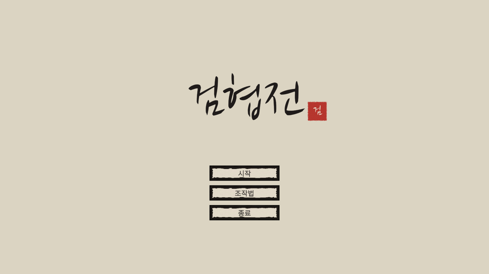
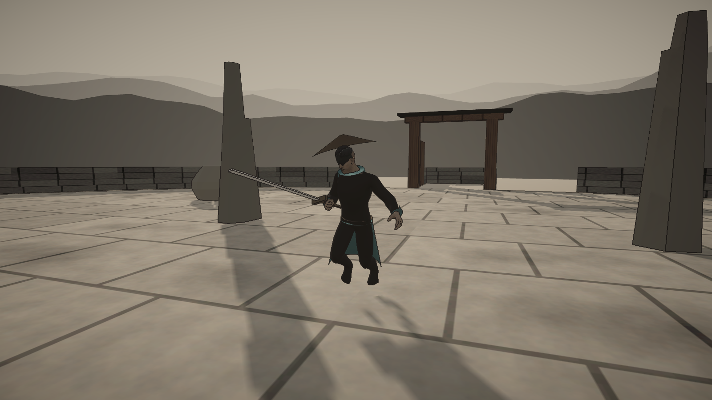
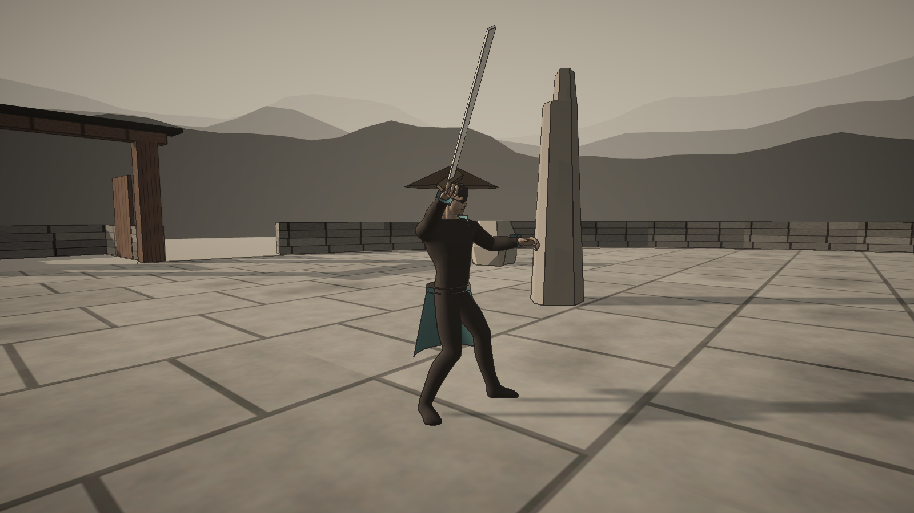
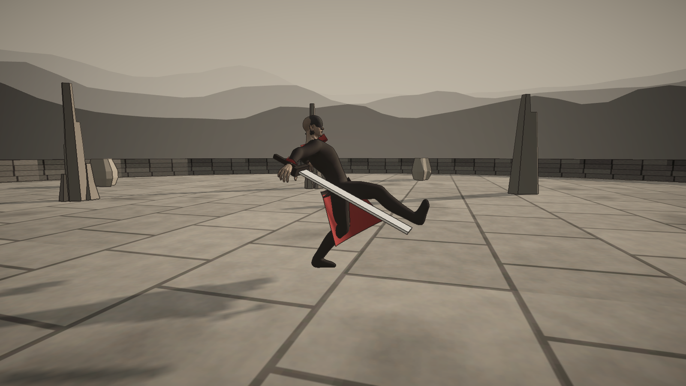
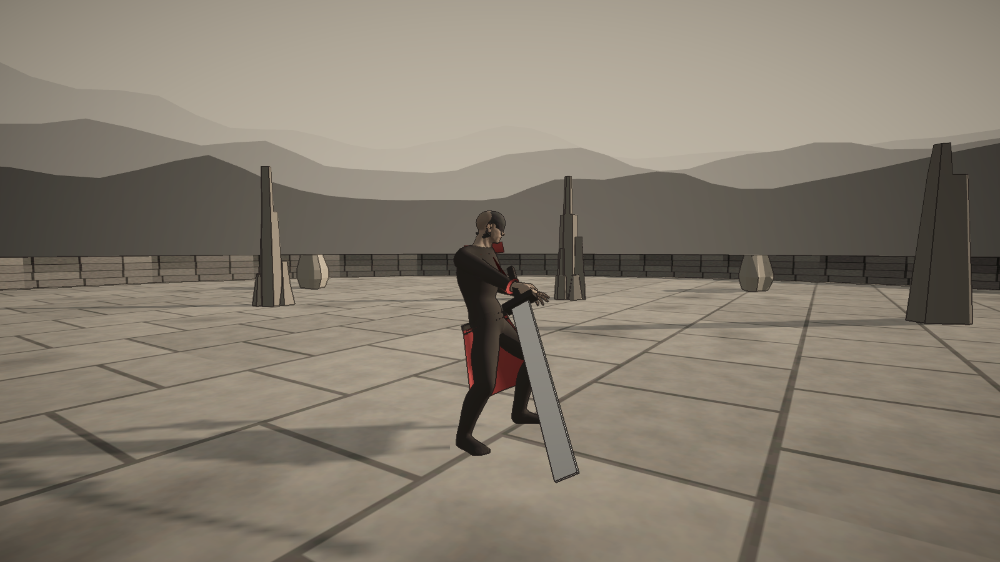
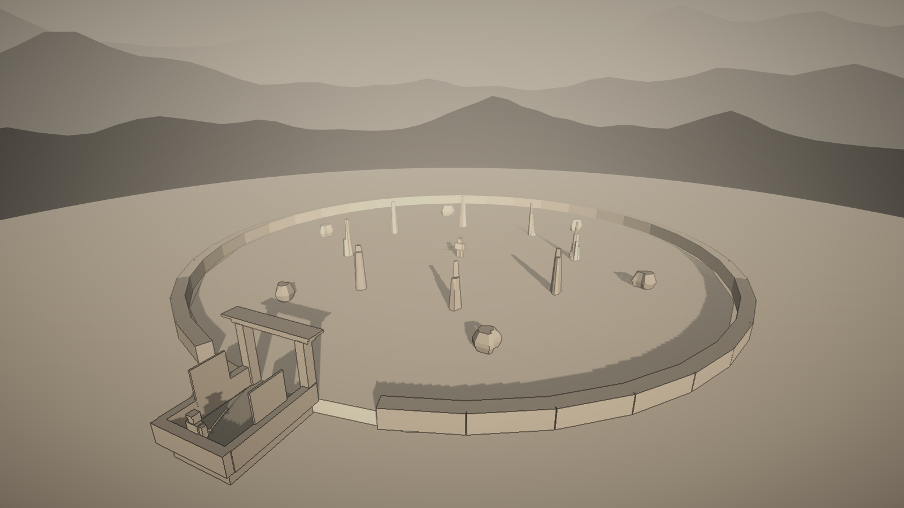
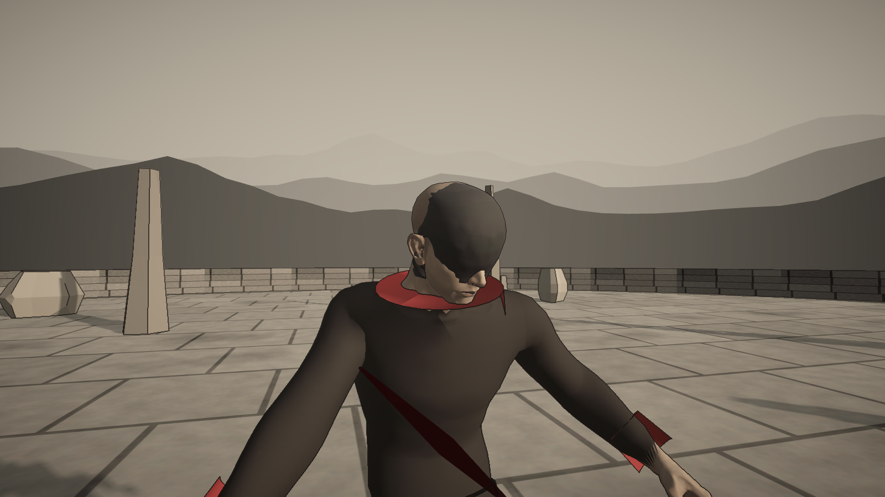
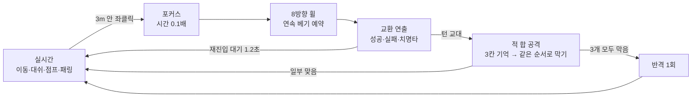

<div align="center">



# 검협전 · SwordLegendStory

**먹으로 그린 무협 세계에서, 한 합 한 합을 고르고 막는 3D 실시간·턴제 검술 액션**


</div>

---

## 어떤 게임인가

평소에는 자유롭게 달리고 피하다가, 적에게 3m 안으로 파고들어 베는 순간 **시간이 느려집니다.**
8방향 검술 휠에서 연속 베기를 예약하면 한 합이 펼쳐지고, 곧바로 적의 차례가 옵니다.
적의 **합 공격**은 휠 위에 붉게 빛난 세 칸을 기억했다가 같은 순서로 막아내야 합니다.

- ⚔️ **고르는 검술** — 직전 검 자세에서 어디로 휘두르느냐에 따라 성공률이 달라집니다(크게 베기 +10%, 짧게 꺾기 −10%).
- 🛡️ **기억으로 막는 방어** — 3칸 순서를 맞히면 검이 튕기고, 모두 막으면 반격 기회.
- 🌀 **주고받는 리듬** — 내 공격이 끝나면 적이 반격하고, 같은 수가 통할수록 적이 경계합니다.
- 🖌️ **수묵 연출** — 먹선 외곽선, 안개 낀 먼 산, 베인 자리에 남는 먹빛 붓 획.

## 화면

<table>
<tr>
<td width="50%"><br><sub>옆걸음 · 칼끝을 적에게(중단 자세)</sub></td>
<td width="50%"><br><sub>합 공격 방어 — 막으며 튕겨내기</sub></td>
</tr>
<tr>
<td><br><sub>적 기술 · 밀쳐 차기</sub></td>
<td><br><sub>베임 — 몸을 젖히며 남는 붓 자국</sub></td>
</tr>
<tr>
<td><br><sub>원형 전투장 · 부서지는 돌기둥</sub></td>
<td><br><sub>적 — 수묵 톤 얼굴과 붉은 깃</sub></td>
</tr>
</table>

## 전투 흐름



## 조작

| 입력 | 동작 |
|---|---|
| `WASD` / 마우스 | 이동 / 시점 |
| 휠 클릭 | 적 고정(락온) — 옆걸음·뒷걸음 |
| 좌클릭 (3m 안) | 선택 화면 → 방향 예약 / 합 공격 방어 입력 |
| 우클릭 | 가드 패링(체력 3) · 선택 중 지나가며 베기(특수기 2) |
| 휠 가운데 칸 | 비도 던지기(기력 3) |
| `Shift` / `Space` | 대쉬 / 점프 |
| `Esc` / `F1` | 일시정지·설정 / 조작 안내 |

## 다섯 가지 스탯

시작 전에 10포인트를 0~3 레벨로 나눕니다. 0포인트로 시작하면 하드코어.

| 스탯 | 하는 일 | 레벨 3 특전 |
|---|---|---|
| **체력** | 최대 체력, 정면 성공률 | 가드 패링 |
| **속도** | 이동·대쉬 충전, 선택 시간, 연속 타수(최대 3), 방어 입력 시간 | 3연속 베기 |
| **기력** | 특수기 쿨타임 | 비도 |
| **힘** | 피해량 | 치명타 |
| **특수기** | 1 대쉬 무적 · 2 지나가며 베기 | 마무리(같은 방향 3번) |

## 적

거리마다 확률표로 기술을 고르고, 같은 기술은 세 번 연속 쓰지 않습니다.

| 거리 | 기술 |
|---|---|
| 0~3m | 큰 검 휘두르기 · 회전 베기 · 밀쳐 차기 · 도약 내려찍기 · 합 공격 |
| 3~6m | **합 공격** · 돌진 베기 · 찌르기 돌진 · 도약 내려찍기 |
| 6~15m | 투척 · 부채 투척 · 돌진 베기 · 도약 내려찍기 |
| 15m~ | 도약 내려찍기 · 부채 투척 |

공격마다 바닥에 붉은 예고 범위와 고유한 예고음(금속 긁힘·북·딱딱이·징)이 있습니다.

## 시작하기

1. **Unity 6000.3.25f1** 설치 (Unity Hub)
2. Unity Hub → **Add** → 이 저장소의 `Game` 폴더
3. `Assets/Game/Scenes/Title.unity`를 열고 ▶ Play
   - 처음 열 때 `Library`를 새로 만드느라 몇 분 걸립니다(저장소에는 올리지 않음).

장면은 코드로 생성합니다. 배치 실행으로 장면 생성 + 규칙 검사:

```bash
Unity.exe -batchmode -nographics -projectPath Game -executeMethod SwordPrototype.Editor.StatRulesVerification.BuildSceneAndVerify -logFile verify.log
```

로그에 `STAT_RULES_OK`가 나오면 통과입니다(전투 규칙·적 확률·방어 입력·애니메이터 구성·UI 배치·라이선스 문서 등).

## 폴더 구조

```text
Game/Assets/Game/
├─ Scripts/
│  ├─ Battle/        전투 규칙 — 스탯, 선택·방어 세션, 판정, 전투 흐름
│  ├─ Enemy/         적 AI — 기술 데이터·확률표, 예고, 투사체
│  ├─ Presentation/  교환 연출, 검 자세 표(Kamae), 애니메이션 출력, 베인 자국
│  ├─ World/         부서지는 소품, 착지 자국, 입구 문
│  ├─ Flow/ · UI/ · Audio/
├─ Editor/           장면·캐릭터·UI·소리 생성기, 규칙 검사, 미리보기 도구
└─ Art/              외부 에셋(LICENSES.md) · 코드로 만든 질감·메시
md/   설계도·구현 현황·결정 기록      html/   같은 내용의 시각 문서와 미리보기
```

## 개발 방식

단계마다 **설계도 → 사용자 확인 → 구현 → 규칙 검사 → Play 확인** 순서로 진행하고, 결정과 결과를 문서에 남깁니다.

- 작업 기준: [`md/roadmap.md`](md/roadmap.md) · [`html/roadmap.html`](html/roadmap.html)
- 현재 상태: [`md/implementation-status.md`](md/implementation-status.md)
- 요구사항·결정 기록: [`md/game-plan.md`](md/game-plan.md)

## 에셋과 라이선스

외부 에셋은 모두 **무료이고 출처 표기 의무가 없는 것**만 사용합니다. 자세한 출처는 [`LICENSES.md`](Game/Assets/Game/Art/LICENSES.md).

| 에셋 | 라이선스 |
|---|---|
| Kenney — Nature Kit, Impact·RPG·Interface Sounds | CC0 |
| Quaternius — Universal Animation Library 1·2, Universal Base Characters | CC0 |
| KayKit — Character Animations | CC0 |
| Noto Sans KR · 나눔손글씨 붓 | SIL OFL 1.1 (라이선스 문서 동봉) |

그 밖의 질감·먼 산·의상·효과음 일부(베기 바람·예고음·배경음)는 코드로 직접 만들었습니다.

---

<div align="center"><sub>검협전은 개발 중인 프로토타입입니다. 수치는 모두 시험값입니다.</sub></div>
